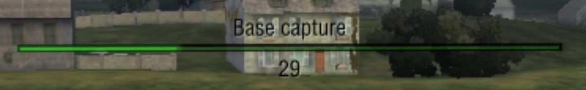

# WoT Blitz - Battle CaptureProgressBar BB Classic




## Description
* [en](public/desc/en.txt)
* [ru](public/desc/ru.txt)

## Install
### Manual install
1. Download suitable `.zip` file from **Releases** section
2. Unpack chosen `.zip` file to `~res:/`

`~res:/` is the gamedata root:
- Android: `/your_sdcard/Android/data`
- Steam: `\Path\To\Steam\steamapps\common\World of Tanks Blitz`

### Build from source

Dependencies
- [`dvpl` converter](https://github.com/Maddoxkkm/dvpl_converter)
- `make`
- `coreutils` (or any other similar utilites)

```sh
make [WMOD_PLATFORM=(android|pc|any)] [WMOD_PUBLISHER=(wg|lg|any)]
```
See [Makefile](Makefile) for details.

### Install from source
```sh
make [WMOD_PLATFORM=...] [WMOD_PUBLISHER=...] [WMOD_INSTALLDIR=<your_path_to_game>] install
```

## Distribute
```sh
make [WMOD_TARGETPLATFORM=...] [WMOD_PUBLISHER=...] dist
```
See [Makefile](Makefile) for available packaging methods.